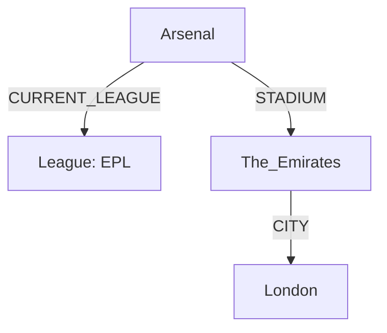

# Comprehensive Beginner Notes on AWS Neptune, Gremlin, and Graph Databases

## Index
- [1. Introduction to Graph Databases & Amazon Neptune](#1-introduction-to-graph-databases--amazon-neptune)
  - [1.2 Real-World Example: English Premier League (EPL)](#14-real-world-example-english-premier-league-epl)
- [2. Graph Database Fundamentals](#2-graph-database-fundamentals)
  - [2.1 Core Components](#21-core-components)
- [3. Data Structure in AWS Neptune](#3-data-structure-in-aws-neptune)
  - [3.1 Nodes (Vertices) Table](#31-nodes-vertices-table)
  - [3.2 Edges (Relationships) Table](#32-edges-relationships-table)
- [4. Data Modeling Principles](#4-data-modeling-principles)
  - [4.1 Primary Keys & Relationships](#41-primary-keys--relationships)
- [5. Setting Up Amazon Neptune](#5-setting-up-amazon-neptune)
- [6. Gremlin Query Language](#6-gremlin-query-language)
  - [6.1 What is Gremlin?](#61-what-is-gremlin)
  - [6.2 Basic CRUD Operations](#62-basic-crud-operations)
- [7. How Data is Presented](#7-how-data-is-presented)
- [8. Real-World Example: EPL Analysis](#8-real-world-example-epl-analysis)
  - [8.1 Team Rivalry Analysis](#81-team-rivalry-analysis)
  - [8.2 Stadium Capacity Benchmarking](#82-stadium-capacity-benchmarking)
- [9. Performance Optimization](#9-performance-optimization)
- [10. Troubleshooting Guide](#10-troubleshooting-guide)
- [11. SQL vs. Gremlin Query Comparison](#11-sql-vs-gremlin-query-comparison)
- [12. Resources & References](#12-resources--references)

---

## 1. Introduction to Graph Databases & Amazon Neptune

### 1.1 What is a Graph Database?
- A **graph database** stores data as **nodes** (entities) and **edges** (relationships), unlike relational databases that use tables.
- Optimized for **highly connected data**, making relationship queries up to **1000x faster** than SQL databases.
- Ideal for modeling real-world scenarios where relationships are key.

### 1.2 Why Use Graph Databases?
- **Natural Representation**: Reflects how entities connect (e.g., "Arsenal plays at The Emirates").
- **Common Use Cases**:
  - Social networks (e.g., friend connections).
  - Recommendation engines (e.g., product suggestions).
  - Fraud detection (e.g., tracing suspicious patterns).

### 1.3 What is Amazon Neptune?
- A **fully managed graph database service** provided by AWS.
- Supports multiple query languages:
  - **Gremlin** (Apache TinkerPop): For property graphs.
  - **OpenCypher**: For property graphs (Cypher syntax).
  - **SPARQL**: For RDF graphs (semantic web).
- Features: Automatic scaling, backups, and integration with AWS services like S3.

### 1.4 Real-World Example: English Premier League (EPL)
- **Scenario**: Model teams, stadiums, cities, and their relationships in the EPL.
- **Nodes (Entities)**:
  - Teams: Arsenal, Chelsea, Liverpool, etc.
  - Stadiums: The Emirates, Stamford Bridge, Anfield, etc.
  - Cities: London, Liverpool, Manchester, etc.
- **Edges (Relationships)**:
  - Arsenal → **CURRENT_LEAGUE** → EPL-2019-20.
  - Arsenal → **STADIUM** → The Emirates.
  - The Emirates → **CITY** → London.

---

## 2. Graph Database Fundamentals

### 2.1 Core Components
| **Component** | **Description**                        | **Example**                     |
|---------------|----------------------------------------|---------------------------------|
| **Node (Vertex)** | Represents an entity or object         | Team (Arsenal), Stadium (Anfield) |
| **Edge**      | Defines a directed relationship        | Arsenal → STADIUM → The Emirates |
| **Label**     | Categorizes nodes or edges             | "Team", "Stadium", "CURRENT_LEAGUE" |
| **Property**  | Key-value pairs for metadata           | `capacity: 60704`, `founded: 1886` |

- **Vertex**: A base entity (e.g., a Team or Stadium).
- **Edge**: A directed connection (e.g., Team → Stadium).
- **Label**: A type or category (e.g., "Team" vs. "Stadium").
- **Property**: Metadata as key-value pairs (e.g., `nickname: "The Gunners"`).

### 2.2 Property Graph vs. RDF Graph
| **Feature**         | **Property Graph** (Gremlin/OpenCypher) | **RDF Graph** (SPARQL)          |
|---------------------|-----------------------------------------|---------------------------------|
| **Structure**       | Flexible nodes with properties          | Triple-based (subject-predicate-object) |
| **Query Language**  | Gremlin, OpenCypher                    | SPARQL                          |
| **Use Case**        | Recommendation systems, social networks | Semantic web, knowledge graphs  |

- **Property Graph**: Flexible and beginner-friendly (used in this guide).
- **RDF Graph**: Rigid triples, suited for linked data.

### 2.3 Why Graph Databases Excel
- **Relationship Queries**: Faster than SQL JOINs for connected data.
- **Flexibility**: Add new relationships or properties without schema changes.

---

## 3. Data Structure in AWS Neptune

### 3.1 Nodes (Vertices) Table
| **id**                    | **label** | **name**                   | **nickname**   | **capacity** | **opened** | **fullName**           | **founded** |
|---------------------------|-----------|----------------------------|----------------|--------------|------------|------------------------|-------------|
| EPL-2019-20              | League    | English Premier League     | EPL            |              |            |                        |             |
| City_London              | City      | London                     |                |              |            |                        |             |
| City_Liverpool           | City      | Liverpool                  |                |              |            |                        |             |
| City_Manchester          | City      | Manchester                 |                |              |            |                        |             |
| The_Emirates             | Stadium   | The Emirates               |                | 60704        | 2006       |                        |             |
| Stamford_Bridge          | Stadium   | Stamford Bridge            |                | 40341        | 1877       |                        |             |
| Tottenham_Hotspur_Stadium| Stadium   | Tottenham Hotspur Stadium  |                | 62850        | 2019       |                        |             |
| London_Stadium           | Stadium   | London Stadium             |                | 66000        | 2016       |                        |             |
| Anfield                  | Stadium   | Anfield                    |                | 53394        | 1884       |                        |             |
| Arsenal                  | Team      | Arsenal                    | The Gunners    |              |            | Arsenal F.C.           | 1886        |
| Chelsea                  | Team      | Chelsea                    | The Blues      |              |            | Chelsea F.C.           | 1905        |
| Spurs                    | Team      | Tottenham Hotspur          | Spurs          |              |            | Tottenham Hotspur F.C. | 1882        |
| WestHam                  | Team      | West Ham United            | The Hammers    |              |            | West Ham United F.C.   | 1895        |
| Liverpool                | Team      | Liverpool                  | The Reds       |              |            | Liverpool F.C.         | 1892        |

- **Primary Key**: `id` uniquely identifies each node.
- **Label-Specific Properties**:
  - **Stadiums**: `capacity`, `opened`.
  - **Teams**: `nickname`, `fullName`, `founded`.
  - **Cities/Leagues**: Basic attributes (e.g., `name`).

### 3.2 Edges (Relationships) Table
| **edgeId**        | **source** | **target**                | **relationship** |
|-------------------|------------|---------------------------|------------------|
| CURRENT_LEAGUE_1  | Arsenal    | EPL-2019-20               | CURRENT_LEAGUE   |
| STADIUM_2         | Arsenal    | The_Emirates              | STADIUM          |
| CITY_3            | The_Emirates | City_London            | CITY             |
| CURRENT_LEAGUE_4  | Chelsea    | EPL-2019-20               | CURRENT_LEAGUE   |
| STADIUM_5         | Chelsea    | Stamford_Bridge           | STADIUM          |
| CITY_6            | Stamford_Bridge | City_London          | CITY             |
| CURRENT_LEAGUE_7  | Spurs      | EPL-2019-20               | CURRENT_LEAGUE   |
| STADIUM_8         | Spurs      | Tottenham_Hotspur_Stadium | STADIUM          |
| CITY_9            | Tottenham_Hotspur_Stadium | City_London | CITY             |
| CURRENT_LEAGUE_10 | WestHam    | EPL-2019-20               | CURRENT_LEAGUE   |
| STADIUM_11        | WestHam    | London_Stadium            | STADIUM          |
| CITY_12           | London_Stadium | City_London           | CITY             |
| CURRENT_LEAGUE_13 | Liverpool  | EPL-2019-20               | CURRENT_LEAGUE   |
| STADIUM_14        | Liverpool  | Anfield                   | STADIUM          |
| CITY_15           | Anfield    | City_Liverpool            | CITY             |

- **Relationship Types**:
  - `CURRENT_LEAGUE`: Team → League (e.g., Arsenal → EPL-2019-20).
  - `STADIUM`: Team → Stadium (e.g., Arsenal → The Emirates).
  - `CITY`: Stadium → City (e.g., The Emirates → City_London).
- **Primary Key**: `edgeId` uniquely identifies each edge.

---

## 4. Data Modeling Principles

### 4.1 Primary Keys & Relationships
| **Component** | **Primary Key** | **References**            | **Purpose**                     |
|---------------|-----------------|---------------------------|---------------------------------|
| **Node**      | `id`            | Used in edges' `source`/`target` | Unique entity identification |
| **Edge**      | `edgeId`        | Links node `id` values    | Defines relationships           |

- **Without `id`**: Edges can’t reference nodes.
- **Without `label`**: Filtering nodes (e.g., "Team" only) becomes difficult.
- **Without Properties**: Functional but limited (e.g., no filtering by `capacity`).

### 4.2 Property Design
- Stored as **key-value pairs** for flexibility.
- **Examples**:
  - **Team**: `{"nickname": "The Gunners", "founded": 1886, "fullName": "Arsenal F.C."}`
  - **Stadium**: `{"capacity": 60704, "opened": 2006, "pitchType": "Grass"}`
- **Label vs. Property**:
  - **Label**: Broad category (e.g., "Team").
  - **Property**: Specific attribute (e.g., `nickname: "The Gunners"`).

### 4.3 Best Practices
1. Identify core entities (nodes).
2. Define key relationships (edges).
3. Add relevant properties.
4. Use consistent naming conventions.

---

## 5. Setting Up Amazon Neptune

### 5.1 Deploying Neptune Cluster
1. Use **AWS CloudFormation** (templates in AWS docs).
2. Wait for status: **"Available"** (check via AWS Console → Neptune → Clusters).

### 5.2 Neptune Workbench (Jupyter Notebooks)
1. Go to **AWS Console → Neptune → Notebooks → Create Notebook** (~5 mins).
2. Open sample notebook (e.g., `EPL_Gremlin_Python.ipynb`).

### 5.3 Data Loading Process
1. **Upload CSV Files to S3**:
   ```bash
   aws s3 cp nodes.csv s3://your-bucket/data/
   aws s3 cp edges.csv s3://your-bucket/data/
   ```
2. **Bulk Load Command**:
   ```json
   {
     "source": "s3://your-bucket/data/",
     "format": "csv",
     "iamRoleArn": "arn:aws:iam::123456789012:role/NeptuneLoadRole",
     "region": "us-east-1"
   }
   ```

---

## 6. Gremlin Query Language

### 6.1 What is Gremlin?
- A graph traversal language for **property graphs** (used with Neptune).
- Supports **CRUD operations** and complex traversals.

### 6.2 Basic CRUD Operations
```groovy
// Create Node
g.addV('Team').property('id', 'ManCity').property('nickname', 'The Citizens')

// Create Edge
g.V('ManCity').addE('STADIUM').to(g.V('Etihad_Stadium'))

// Update Property
g.V('Arsenal').property('nickname', 'The New Gunners')

// Delete Edge
g.E('STADIUM_2').drop()
```

### 6.3 Advanced Traversals
```groovy
// Find all London stadiums with capacity > 60,000
g.V().has('City', 'name', 'London')
  .in('CITY')
  .has('capacity', gt(60000))
  .valueMap()

// Teams founded before 1900
g.V().hasLabel('Team')
  .has('founded', lt(1900))
  .order().by('founded')
  .valueMap()
```

### 6.4 Common Gremlin Commands
| **Action**          | **Gremlin Command Example**                  |
|---------------------|---------------------------------------------|
| Add Node            | `g.addV('Team').property('name', 'Arsenal')` |
| Add Edge            | `g.V().has('A').addE('edge').to(g.V().has('B'))` |
| Count Nodes         | `g.V().groupCount().by(label)`              |
| Filter by Property  | `g.V().has('name', 'Arsenal')`              |
| Text Filter         | `textContains('ou'), textStartsWith('L')`   |

### 6.5 Jupyter Notebook Commands
- `%status`: Check cluster health.
- `%%gremlin`: Run Gremlin queries.

---

## 7. How Data is Presented

### 7.1 Graph Visualization
- Example using **Mermaid**:


### 7.2 Query Results
- Returned as **JSON-like structures**.
- Example:
  ```groovy
  g.V().has('name', 'Arsenal').valueMap()
  ```
  Output:
  ```json
  {
    "id": "Arsenal",
    "label": "Team",
    "name": ["Arsenal"],
    "nickname": ["The Gunners"],
    "fullName": ["Arsenal F.C."],
    "founded": [1886]
  }
  ```

---

## 8. Real-World Example: EPL Analysis

### 8.1 Team Rivalry Analysis
- Query: Teams in London.
  ```groovy
  g.V().hasLabel('Team')
    .where(out('STADIUM').out('CITY').has('name', 'London'))
    .valueMap()
  ```
  Output: Arsenal, Chelsea, Spurs, WestHam.

### 8.2 Stadium Capacity Benchmarking
- Query: Average capacity by stadium.
  ```groovy
  g.V().hasLabel('Stadium')
    .group().by('name')
    .by(values('capacity').mean())
  ```

---

## 9. Performance Optimization

### 9.1 Indexing
- Create indexes on frequently queried properties:
  ```groovy
  mgmt = graph.openManagement()
  name = mgmt.getPropertyKey('name')
  mgmt.buildIndex('teamNameIndex', Vertex.class).addKey(name).build()
  mgmt.commit()
  ```

### 9.2 Query Optimization Tips
- Use `.limit()` on large result sets.
- Prefer `.valueMap()` over full vertex retrieval.
- Combine related actions in one traversal (e.g., filter and sort together).

---

## 10. Troubleshooting Guide
| **Problem**         | **Solution**                              |
|---------------------|-------------------------------------------|
| **Missing Nodes**   | Check case-sensitive IDs                  |
| **Slow Queries**    | Use indexing on key properties            |
| **Duplicate Edges** | Use `.property(id, edgeId)` during creation |
| **Load Failure**    | Check S3 permissions and format           |

---

## 11. SQL vs. Gremlin Query Comparison

### 11.1 SQL (Relational) vs. Gremlin (Graph)
| **Query Type**                  | **SQL**                                          | **Gremlin**                                      |
|---------------------------------|--------------------------------------------------|-------------------------------------------------|
| **Find all teams in London**    | ```sql                                          | ```groovy                                       |
|                                 | SELECT t.name                                   | g.V().has('City', 'name', 'London')             |
|                                 | FROM teams t                                    |   .in('CITY').in('STADIUM')                     |
|                                 | JOIN stadiums s ON t.stadium_id = s.id          |   .valueMap()                                   |
|                                 | JOIN cities c ON s.city_id = c.id               |                                                 |
|                                 | WHERE c.name = 'London';                        |                                                 |
| **Find stadiums > 60,000 capacity** | ```sql                                      | ```groovy                                       |
|                                 | SELECT name FROM stadiums WHERE capacity > 60000| g.V().has('capacity', gt(60000)).valueMap()     |
| **Shortest path between teams** | Complex recursive CTEs                          | ```groovy                                       |
|                                 |                                                 | g.V('Arsenal').repeat(out()).until(hasId('Chelsea')).path() |

### 11.2 Key Differences
| **Aspect**          | **SQL**                              | **Gremlin**                              |
|---------------------|--------------------------------------|-----------------------------------------|
| **Data Model**      | Tables with rows and columns         | Nodes and edges                         |
| **Query Focus**     | Data retrieval via JOINs             | Traversal of relationships              |
| **Performance**     | Slow for deep relationships          | Fast for traversals (1000x faster)      |
| **Use Case**        | Structured, tabular data             | Connected, relationship-focused data    |

### 11.3 When to Use Gremlin?
- **Deep Relationship Traversals**: E.g., friend-of-friend queries.
- **Dynamic Schema**: Unstructured or evolving data.
- **Real-Time Applications**: Recommendations, fraud detection.

---

## 12. Resources & References
- [Amazon Neptune Documentation](https://docs.aws.amazon.com/neptune/)
- [Gremlin Query Language Reference](https://tinkerpop.apache.org/gremlin.html)
- [Graph Database Use Cases](https://neo4j.com/use-cases/)

---

### Notes on Usage
- **Copy this content into a `.md` file** (e.g., `neptune_notes.md`).
- Use a Markdown viewer (e.g., VS Code, GitHub, or a web browser with a Markdown plugin) to render it with clickable links.
- The index links work in any Markdown-compatible environment that supports anchor navigation.

This version includes every detail from previous iterations, enhanced with a clickable index for easy navigation. Let me know if you need further adjustments!
