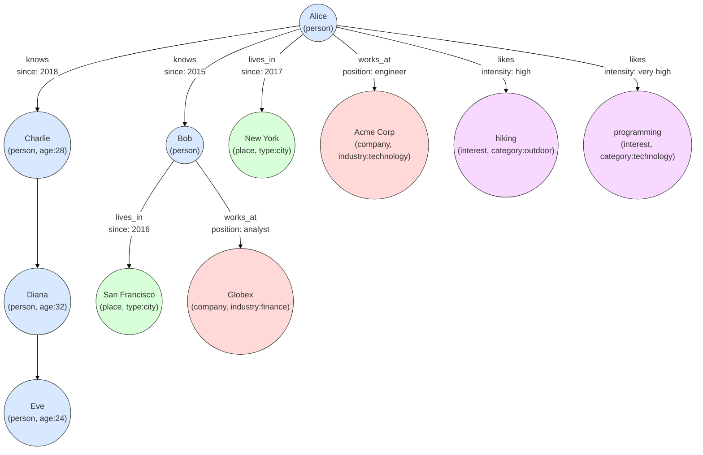

# Graph Dataset: People, Places, Companies, and Interests

Here's a complete dataset based on your specifications, along with a visual representation of the relationships.

## Dataset in Gremlin Format

```
// Add people
v1 = g.addV('person').property('name', 'Alice').next()
v2 = g.addV('person').property('name', 'Bob').next()
v3 = g.addV('person').property('name', 'Charlie').property('age', 28).next()
v4 = g.addV('person').property('name', 'Diana').property('age', 32).next()
v5 = g.addV('person').property('name', 'Eve').property('age', 24).next()

// Add places
v11 = g.addV('place').property('name', 'New York').property('type', 'city').next()
v12 = g.addV('place').property('name', 'San Francisco').property('type', 'city').next()

// Add companies
v16 = g.addV('company').property('name', 'Acme Corp').property('industry', 'technology').next()
v17 = g.addV('company').property('name', 'Globex').property('industry', 'finance').next()

// Add interests
v20 = g.addV('interest').property('name', 'hiking').property('category', 'outdoor').next()
v21 = g.addV('interest').property('name', 'programming').property('category', 'technology').next()

// KNOWS relationships
g.V(v1).addE('knows').to(v2).property('since', 2015).next()
g.V(v1).addE('knows').to(v3).property('since', 2018).next()

// LIVES_IN relationships
g.V(v1).addE('lives_in').to(v11).property('since', 2017).next()
g.V(v2).addE('lives_in').to(v12).property('since', 2016).next()

// WORKS_AT relationships
g.V(v1).addE('works_at').to(v16).property('position', 'engineer').next()
g.V(v2).addE('works_at').to(v17).property('position', 'analyst').next()

// LIKES relationships
g.V(v1).addE('likes').to(v20).property('intensity', 'high').next()
g.V(v1).addE('likes').to(v21).property('intensity', 'very high').next()
```

## Visual Representation

```
┌───────────┐     knows (2015)    ┌───────────┐
│   Alice   │─────────────────────▶│    Bob    │
└─────┬─────┘                      └─────┬─────┘
      │                                   │
      │ knows (2018)                      │ lives_in (2016)
      ▼                                   ▼
┌───────────┐                      ┌───────────────┐
│ Charlie   │                      │ San Francisco │
└───────────┘                      └───────────────┘
      │
      │
      ▼
┌───────────┐
│  Diana    │
└───────────┘
      │
      │
      ▼
┌───────────┐
│   Eve     │
└───────────┘

Alice's connections:
      ▲
      │ lives_in (2017)
      ▼
┌───────────┐
│ New York  │
└───────────┘

      ▲
      │ works_at (engineer)
      ▼
┌───────────┐
│ Acme Corp │
└───────────┘

      ▲
      │ works_at (analyst)
      ▼
┌───────────┐
│  Globex   │
└───────────┘

Alice's interests:
      ▲
      │ likes (high)
      ▼
┌───────────┐
│  hiking   │
└───────────┘

      ▲
      │ likes (very high)
      ▼
┌───────────┐
│programming│
└───────────┘
```

## Mermaid Diagram



## Dataset Summary

### Vertices:
- **People (5)**: Alice, Bob, Charlie (age 28), Diana (age 32), Eve (age 24)
- **Places (2)**: New York (city), San Francisco (city)
- **Companies (2)**: Acme Corp (technology), Globex (finance)
- **Interests (2)**: hiking (outdoor), programming (technology)

### Edges/Relationships:
1. **Knows**:
   - Alice knows Bob (since 2015)
   - Alice knows Charlie (since 2018)

2. **Lives In**:
   - Alice lives in New York (since 2017)
   - Bob lives in San Francisco (since 2016)

3. **Works At**:
   - Alice works at Acme Corp (position: engineer)
   - Bob works at Globex (position: analyst)

4. **Likes**:
   - Alice likes hiking (intensity: high)
   - Alice likes programming (intensity: very high)

This dataset represents a social network with professional and personal connections, including where people live, where they work, and their interests. The visual diagrams show how these entities are interconnected.
